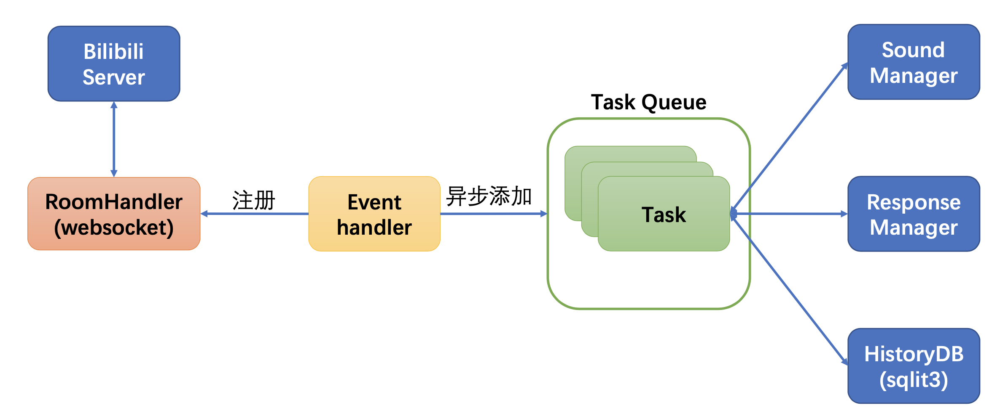

# LiveStreamAI

基于ChatGPT的Bilibili直播AI(~~新概念挖矿~~)。
[js版本](https://github.com/xwy27/LiveStreamAI/tree/js_env)

## 概览




## 依赖环境

- Python>=3.8
- 可以访问OpenAI的网络及其API Key
- (可选)虚拟环境，如conda

## 使用说明

1. 下载源码

```bash
git clone https://github.com/xwy27/LiveStreamAI.git
```

2. 安装依赖

```bash
cd LiveStreamAI
pip install -r requirements.txt
```

### 快速体验（不接入ChatGPT）

1. 修改配置

修改`config`目录下的`config.txt`，仅需直播间的房间号(如直播链接`https://live.bilibili.com/139?...`中的`139`为房间号)

2. 启动

```bash
python main.py
```

3. 使用

打开直播，程序会自动监听直播间的弹幕，并对以`Q:`开头的弹幕提问进行回复。

### 开始使用

1. 修改配置

- 必须
  修改`config`目录下的`config.txt`，包括直播间的房间号(如直播链接`https://live.bilibili.com/139?...`中的`139`为房间号)以及OpenAI的api key；将`handler/handler.py`中的`testResponseManager`替换为`openAIResponseManager`。
- 可选
  修改`config`目录下的`UpCharacteristic.txt`可以让ChatGPT提供不同的直播风格(等同于prompt)。

2. 启动

```bash
python main.py
```

3. 使用

启动后，打开直播即可。程序会自动监听直播间的弹幕，并对以`Q:`开头的弹幕提问进行回复。

## Q&A

1. 能否定制声音？

目前的声音输出采用的是edge提供的tts功能，基于edge-tts库实现。所以在实现过程中，sound操作是分离的。在`chat/sound.py`中继承`BaseSoundManager`实现自己的声音播放类，并在`RoomHandler`中替换掉`edgeTTSSoundManager`即可。

2. 能否自己控制回复？

同样提供自定义功能，在`chat/chat.py`中继承`BaseResponseManager`实现自己的回复生成类，并在`RoomHandler`中替换掉`TestResponseManager`即可。

3. 为什么没有皮套？

没有接触过，有能力的朋友可以来上一套。

4. 对话历史是怎么存的？

从ChatGPT的文档来看，调用api需要自行维护对话历史，这里通过sqlite3为每个用户单独存历史对话信息，用b站的用户名作为key，分别存储累积发送到openai的对话数据。具体可以看`utils/DB.py`。

5. 还有可以做的吗？

有很多，比如前面提到的几个问题，还有:
- 代码优化(作者自己代码也写得不好，虽然尽量模块化处理了，但肯定可以优化)
- UI展示(给用户提供一个使用界面，自行输入配置，启动和退出等)
- 数据文件定期清理(互动数据会不断积累，但并非都是有用的历史对话信息)
- 更合理的弹幕输入(目前采取FIFO模式并回调下一个，同时为保证实时性，回调时过滤15s前的弹幕)
- 更多的互动形式
- 发挥想象力，基于目前的代码做成QA机器人
- ...
